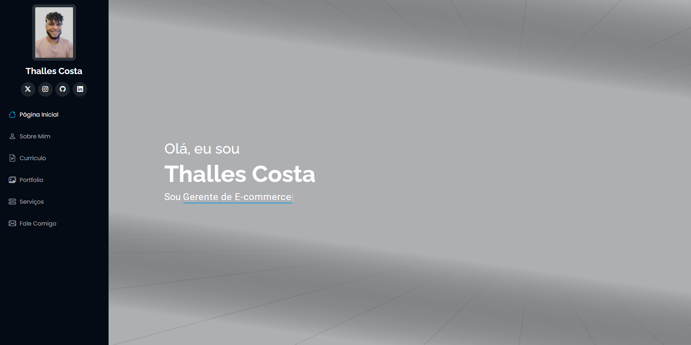

# Portfólio Profissional - Thalles Costa



Um portfólio profissional moderno e responsivo, desenvolvido para apresentar minha experiência em E-commerce e Marketing Digital.

## 🚀 Demonstração

Acesse o projeto em funcionamento: [Link do Projeto](https://seu-usuario.github.io/nome-do-repositorio)

## 📋 Características

- Design responsivo e moderno
- Animações suaves com AOS (Animate On Scroll)
- Seções organizadas para:
  - Sobre
  - Experiência
  - Portfólio
  - Serviços
  - Contato
- Galeria de projetos com filtros
- Formulário de contato funcional
- Otimizado para SEO

## 🛠️ Tecnologias Utilizadas

- HTML5
- CSS3
- JavaScript
- Bootstrap 5
- PHP (para o formulário de contato)
- Bibliotecas:
  - AOS (Animate On Scroll)
  - GLightbox
  - Swiper
  - Isotope
  - Typed.js

## 📦 Estrutura do Projeto
 ```├── assets/
│ ├── css/
│ ├── img/
│ ├── js/
│ └── vendor/
├── forms/
├── index.html
├── portfolio-details.html
├── service-details.html
└── starter-page.html
```

## 📄 Páginas

- **index.html**: Página principal com todas as seções
- **portfolio-details.html**: Template para detalhes dos projetos
- **service-details.html**: Template para detalhes dos serviços
- **starter-page.html**: Template base para novas páginas

## 💡 Personalização

1. **Informações Pessoais**: Edite o arquivo `index.html` para atualizar suas informações
2. **Imagens**: Substitua as imagens em `assets/img/`
3. **Estilos**: Personalize o CSS em `assets/css/main.css`
4. **Cores**: Ajuste as variáveis CSS no início do arquivo `main.css`

## 📱 Responsividade

O site é totalmente responsivo e se adapta a diferentes tamanhos de tela:
- Desktop (1200px+)
- Tablet (768px - 1199px)
- Mobile (até 767px)

## 📫 Contato

- Email: costa.thalles71@gmail.com
- LinkedIn: [Seu LinkedIn](https://www.linkedin.com/in/thallesfcosta/)
- Website: [Thallescosta.io](thallescosta.io)

## 📝 Licença

Este projeto está sob a licença MIT. Veja o arquivo [LICENSE](LICENSE) para mais detalhes.

## 🎁 Agradecimentos

- [Bootstrap](https://getbootstrap.com/)
- [BootstrapMade](https://bootstrapmade.com/)
- Ícones por [Bootstrap Icons](https://icons.getbootstrap.com/)
